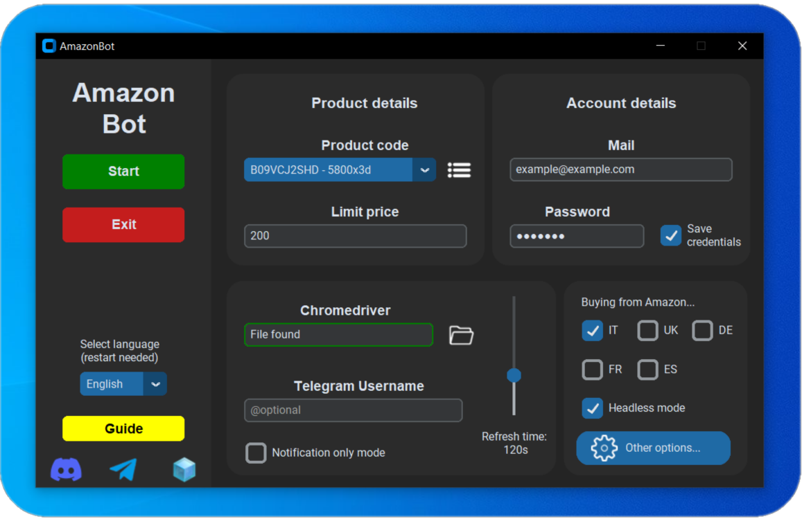
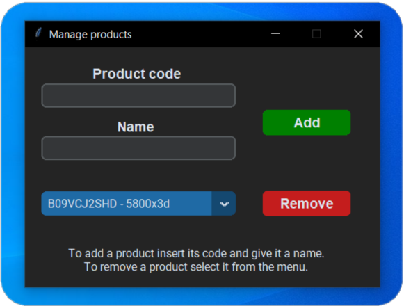
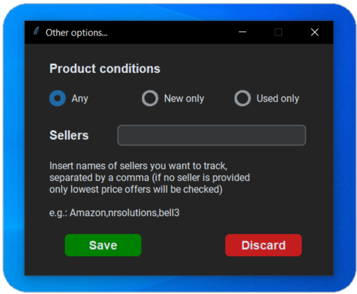
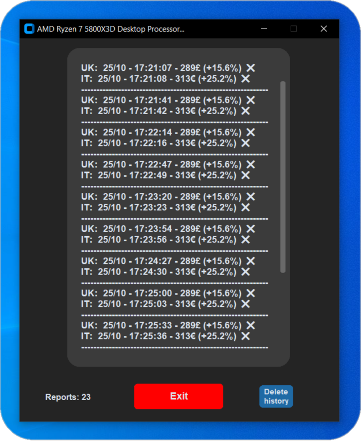

# AmazonBot
AmazonBot is an easy-to-use software that allows users to track desired products on the Amazon website using [Selenium](https://github.com/SeleniumHQ/selenium) webdriver.
More specifically it can periodically check the product's price and buy it once below the threshold set by the user 
(alternatively the user can be notified on a Telegram group by a message containing the link to the product page and current price).

<em>Example of main page screen</em>

&nbsp

Users can save products by providing the product ASIN and a name. They can also remove a previously saved product
by selecting it from the drop-down menu. Information is stored in a separate json file.

&nbsp

Other tracking parameters that can be configured are product conditions (new or used) and sellers
(as of now these checks are done on the text appearing in the product page).

---

The GUI has been made using [CustomTkinter](https://github.com/TomSchimansky/CustomTkinter) 
and text is provided in both english and italian.
Just like products, account credentials can be saved as well: user's email and password will be encrypted
using the cryptography library and stored in a txt file alongside the encryption key. For better security
all these three elements will be slightly modified before being saved.

All tracking parameters that can be configured:
<ul>
<li>Product price</li>
<li>Product conditions</li>
<li>Sellers</li>
<li>Time interval between page refreshes</li>  
</ul>

Moreover the user can choose to track the product on different Amazon stores at the same time (specifically the five european Amazon websites minus Netherlands).
In this case multiple threads will be created, one for each store.
Each thread then communicates price reports to a logger window that can also be used to stop the tracking process.
  
The user can also decide to run Chrome tabs in headless mode, although it is mostly recommended when they want to receive an alert on the Telegram group.
  
In the case where the program cannot complete a purchase in headless mode a new attempt will be performed non-headless.
If a problem occours even in this mode a Telegram alert will be sent, whether the user provided his @ or not.

